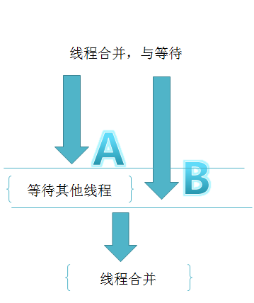
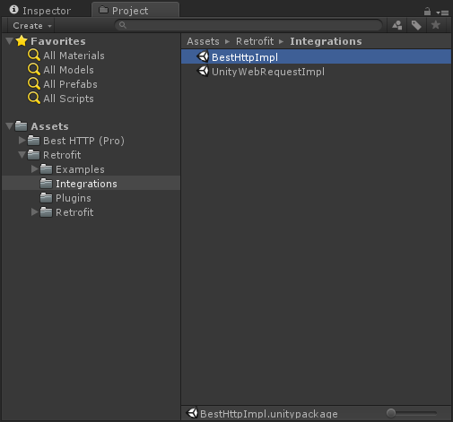

# Retrofit for Unity
## 简介

Retrofit for Unity把Http API描述变成接口直接使用。下面是一个REST API的接口化定义
```cs
 public interface IHttpBinInterface
    {
        [Get("/get")]
        IObservable<HttpBinResponse> Get(
            [Query("query1")]string arg1,
            [Query("query2")]string arg2
            );
     }
```
## 如何使用
3个步骤：
-**[1] 定义一个Interface**:该接口用来管理你的 HTTP API。
-**[2] 动态创建接口服务类**：

```cs
   RetrofitAdapter adapter = new RetrofitAdapter.Builder()
            .SetEndpoint("http://httpbin.org")
	        .Build();
	    httpService = adapter.Create<IHttpBinInterface>();
```

-**[3] 调用方法**: HttpBinService将负责把你的方法调用变成向服务端发送的Http网络请求。
```cs
 var ob = httpService.Get("abc", "123");
     ob.SubscribeOn(Scheduler.ThreadPool)//send request in sub thread
          .ObserveOn(Scheduler.MainThread)//receive response in main thread
          .Subscribe(data =>
              {
                   // onSuccess
                   Debug.LogFormat("Received on threadId:{0}", Thread.CurrentThread.ManagedThreadId);
              },
              error =>
              {
                  Debug.Log("Retrofit Error:" + error);
              });
```
> 支持相应式编程，在Unity版本中也有Reactive Extension的扩展 [`UniRx`](https://github.com/neuecc/UniRx)，借助UniRx,可以快速实现Retrofit for Unity的异步请求。

## API 声明
在接口的方法中使用C# 特性来标识一个请求将被怎么发送，特性可以被标识在方法和方法参数上。
### 请求方式
每一个方法必须要有一个Http方法类型的特性来提供请求方式以及相对地址，该组件提供6种内置的特性来标识GET, POST, PUT, DELETE, PATCH and HEAD请求，相对地址在特性中标识即可。
```cs
 [Get("/users")]
```
 当然，也可以直接在URL地址中使用查询URL。
```cs
[GET("/users/list?sort=desc")]
```
### URL动态组装
URL可以通过中括号+变量名来动态组装，如`{`any string`}`,同时，用来动态替换URL的参数必须使用 [Path]特性来标识，并且需要使用相同的string值。
```cs
[Get("/group/{id}/users")]
IObservable<<List<User>> GetList(
    [Path("id")] int groupId);
```
Query查询语句也可以使用同样的方式来组装动态查询URL。
```cs
[Get("/group/{id}/users")]
IObservable<<List<User>> GetList(
    [Path("id")] int groupId,
    [Query("sort")] string sort);
```

对于更复杂的查询，建议使用QueryMap来实现。并且通过这种方式可以实现数量可变的查询URL。
```cs
[Get("/group/{id}/users")]
IObservable<<List<User>>GroupList(
    [Path("id")] int groupId,
    [QueryMap] Dictionary<string, string> options);
```
### 带BODY的请求
一个Body对象可以通过 [Body] 特性来完成带Body的请求。
```cs
[POST("/users/new")]
IObservable<User> CreateUser(
	[Body] User user);
```
该object对象将使用RestAdapter中指定的转换器Convert来把对象转换成string并发往服务端，默认情况下，RestAdapter将使用`DefalutConverter(Implemented by Newtonsoft.json)` 来完成转换任务。
### FORM ENCODED请求
方法也可以声明为发送form-encoded 数据的请求。
当有参数使用[Field]特性标识时，[Field]中的字符将作为健，参数值将作为值来发送form-encoded数据。
```cs
[POST("/user/edit")]
IObservable<User> UpdateUser(
	[Field("first_name")] string first,
	[Field("last_name")] string last);
```
### HEADER 的组装
可以使用 [Headers] 特性来标识静态的Header数据
```cs
[Headers("Cache-Control: max-age=640000")]
[GET("/widget/list")]
IObservable<List<Widget>> WidgetList();
```
```
[Headers({
    "Accept: application/vnd.github.v3.full+json",
    "User-Agent: Retrofit-Sample-App"
})]
[GET("/users/{username}")]
IObservable<User> GetUser(
	[Path("username")] string username);
```
注意：Headers没有同健覆盖功能，即使Headers的健相同也会一起发送出去。
如果需要动态组装Header，可以在参数中用`[Header]`来标识这是一个动态参数化的Header组装。

```cs
[GET("/user")]
IObservable<User> GetUser(
	[Header("Authorization")] string authorization)
```
## Retrofit 配置
`RestApater` 类负责将API接口转换成可以调用方法的对象。默认情况下Retrofit会自动配置好供你调用，当然所有的配置都是可以自定义的，这是为了方便扩展以及功能细分。
### 序列化和反序列化配置
Retrofit默认使用 Newtonsoft.json 库来完成序列化和反序列化。
如果API接口返回的结构不能被默认配置的解析库解析，或者你想要用别的库来完成转换工作，那么这个时候，你只需要创建一个类并实现 `Converter` 接口，并在Adapter的`Setup()`中指定这个实例来完成转换的工作即可。

## 结合Rx的异步网络请求实践

```
 var observable = RxRestBestHttpClient.Instance.RxGetList("square", "retrofit");//声明可观察对象
	 observable
            .SubscribeOn(Scheduler.ThreadPool) //将网络请求切换到预定义的线程池中的某个线程执行
            .ObserveOnMainThread()  //请求完成时，在主线程呈现数据
            .Subscribe(
                data =>
                {
                    Debug.LogFormat("Receive on threadId:{0}", Thread.CurrentThread.ManagedThreadId);
                    Debug.Log("Retrofit Success:" + data[0].testField);
                },
                error =>
                {
                    Debug.LogError("Retrofit Error:" + error);
                });
```
定义可观察对象后observable之后，通过observable.Subcribe(`Action<T>` onNext, `Action<Exception>` onError)的调用后，网络请求才会发送出去，默认情况下，如果没有调用`SubscribeOn()`和`ObserveOn()`，请求线程跟回调线程都是在主线程完成。

### Scheduler+Linq多线程请求与切换
#### 使用Scheduler完成多线程请求与回调切换
在上面的例子种可以看到IObserable在被订阅前使用了2个方法：`SubscribeOn(Scheduler.ThreadPool) `和`ObserveOnMainThread()`，实际上他们是使用了`IObserable<T>`的扩展方法`SubscribeOn`and `ObserveOn`,

1/`SubscribeOn` 告诉Rx可观察对象的产生运行在哪个线程。
2/`ObserveOn`告诉Rx数据流的观察处理运行在哪个线程。

所以如果需要做一些耗时操作，例如网络请求和文件读写都可以通过SubscribeOn来将他们放到异步线程去处理。然后通过ObserveOn来在主线程处理回调的数据。中间不需要关心线程安全的问题，Rx已经在底层帮我们处理好了。
> 注意：如果SubcribeOn调用之后，不调用ObserveOn，那么观察也会在运行在之前切换到的子线程。并不会自动切换回主线程处理观察数据。


#### 使用Linq扩展操作符简化开发
Rx除了支持LINQ的原生操作符，并且拓展了许多很实用的操作符，并且可以支持自定义操作符，操作符的数量在源源不断的添加中。具体请参考[文档](http://reactivex.io/documentation/operators.html)，这里列举几个业务模块中经常使用到场景。

##### 线程串联

在业务开发中，遇到需要先请求X，通过X的响应数据，再请求Y，通过Y的响应数据，最后请求Z，时序模型如下图。
可以通过Linq语法这样写，Rx已经内部实现对Linq的支持。


```
var quert = from x in ObserableWWW.Get("http://github.com");
			from y in ObserableWWW.Get(x)
			from z in ObserableWWW.Get(y)
			select new {x,y,z}
query.Subcribe(x=>Debug.Log(x),ex=>Debug.LogException(ex));
```
##### 线程合并
在业务开发中，遇到需要先请求A和B，需要A和B的请求都返回后进行下一步，任意一个请求出错下一步都无法执行，并且只有2个网络请求都返回结果之后才进行下一步的处理，而且A和B两个网络请求没有关联，运行在不同线程，时序模型如下图。

```
var query = Observable.Zip(
			ObserableWWW.Get("http://github.com")),
			ObserableWWW.Get("http://google.com")),
			(github,google) => new {goole,bing});
			
query.Subcribe(x=>Debug.Log(x),ex=>Debug.LogException(ex));
```
这里只需要通过一个扩展操作符`Zip`来实现即可，完成了线程等待和线程合并的功能。

##### 更多操作符

Rx提供了许多操作符来简化程序员的工作，上面介绍的只是冰山一角，更多的操作符在官网有介绍，并且大部分UniRx都可以支持，如果在遇到一个业务场景的时候，不知道选择哪个操作符可以实现我们的功能，那么可以参考[A Decision Tree of Observable Operators](https://reactivex.io/documentation/operators.html)，来辅助选择操作符

## 与不同Http模块的结合
Retrofit只是一种代码风格的设计，可以美化代码及方便管理API。它并不会真正的发送任何一个Http网络请求。这些工作都交给底层的网络请求库来实现，这也就意味着`Retrofit for Unity` 可以跟各种各样的`网络请求插件`或者是Unity官方的 `UnityWebRequest `模块来结合使用。默认情况下，该组件提供3种组合方式，即`HttpClient`、`UnityWebRequestImpl` and `BestHttpImpl`，默认情况下使用HttpClient作为底层网络请求模块，因为它是一个基于`System.Net`的非常简洁的RESTful API的网络请求模块，并且完全开源。如果你需要跟其他网络插件结合使用，那么只需要实现HttpImplement接口，并在Adapter的`Setup()`中指定一个实例即可。

### 与 BESTHTTP的结合使用

1. 导入BestHttp 插件.
2. 导入Retrofit for Unity.
3. 导入在Integrations目录下的`BestHttpImpl.unitypackage` .
  
4. 在构建RetrofitAdapter使用新的BestHttpImpl实例.
```cs
RetrofitAdapter adapter = new RetrofitAdapter.Builder()
            .SetEndpoint("http://httpbin.org")
            .SetClient(new BestHttpImpl());
	        .Build();
```


### 与 UNITYWEBREQUEST的结合

>要想使用 UnityWebRequest,  unity 版本必须是5.4或更高.

1. 导入Retrofit for Unity.
2. 导入在Integrations目录下的`UnityWebRequestImpl.unitypackage`.
  
3. 在构建RetrofitAdapter使用新的UnityWebRequestImpl实例.
```cs
 RetrofitAdapter adapter = new RetrofitAdapter.Builder()
            .SetEndpoint("http://httpbin.org")
            .SetClient(new UnityWebRequestImpl());
	        .Build();
```


